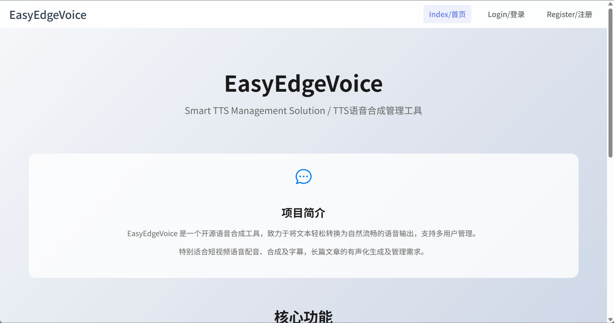
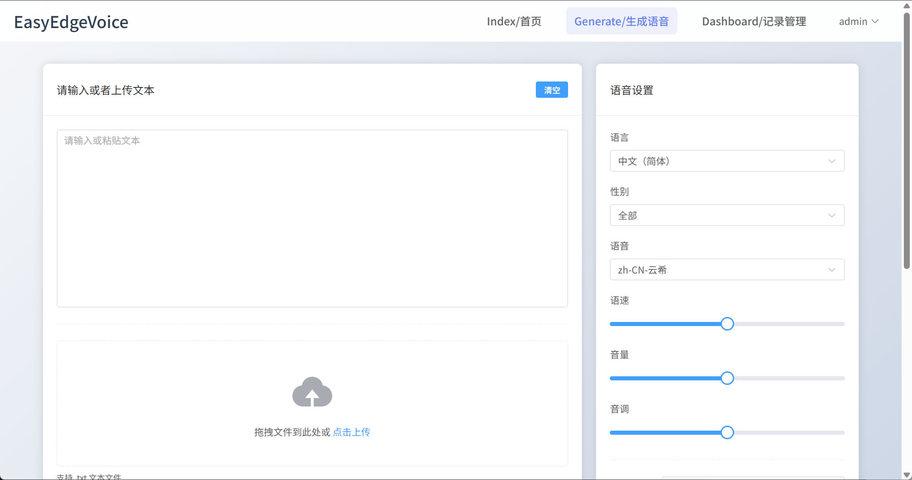
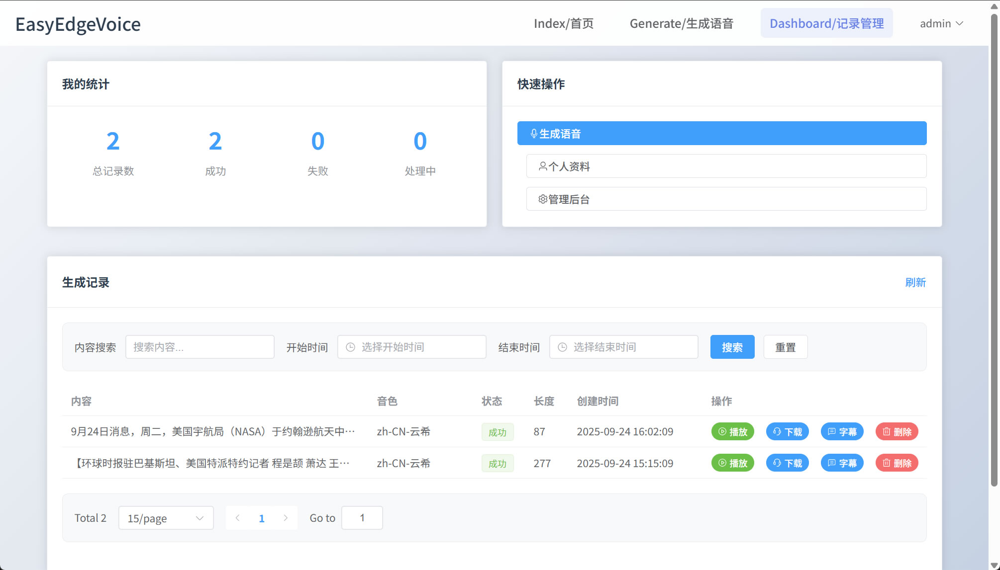
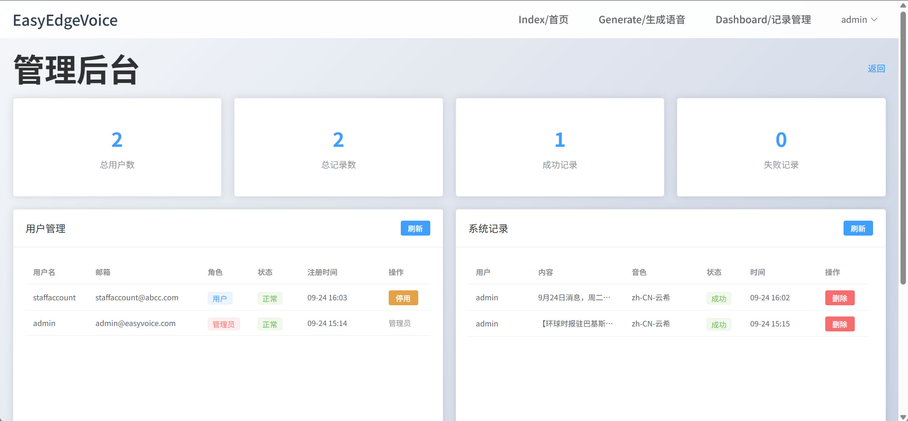

# EasyEdgeVoice 🎙️

## 项目简介 ✨  

**EasyEdgeVoice** 是一个开源的文本、智能文本转语音解决方案，旨在帮助用户轻松将文本内容转换为高质量的语音输出，同时支持多用户管理及内容管理。  

- **一键生成语音和字幕**

- **完全免费，无时长、无字数限制**

- **支持将 10 万字以上的小说一键转为有声书！**

- **流式传输，多长的文本都能立刻播放**

- **支持自定义多角色配音**

- **支持多账号登录和内容管理**

无论你是想听小说、为创作配音，还是打造个性化音频，EasyEdgeVoice 不仅能帮你生成音频，还能帮你管理好！

**你可以轻松的将 EasyEdgeVoice 部署到你的云服务器或者本地！**


## 核心功能 🌟

- **文本转语音** 📝 ➡️ 🎵  
  一键将大段文本转为语音，高效又省时。
- **流式传输** 🌊  
  再多的文本，都可以迅速返回音频直接开始试听！
- **多语言支持** 🌍  
  支持中文、英文等多种语言。  
- **字幕支持** 💬  
  自动生成字幕文件，方便视频制作和字幕翻译。  
- **角色配音** 🎭  
  提供多种声音选项，完美适配不同角色。  
- **自定义设置** ⚙️  
  可调整语速、音调等参数，打造专属语音风格。  
- **试听功能** 🎧  
  生成前可试听效果，确保每一句都如你所愿！  
- **管理功能** ⚙️   
  支持多账号及内容管理，方便对内容进行分工和管控！支持定制，请联系 maozilee@gmail.com

## Screenshots📸






## 快速开始 🚀

### 本地运行项目（请先确保已安装 Node.js 环境，参考：[安装 Node.js](https://zhuanlan.zhihu.com/p/442215189)）

```bash
# 开启/安装 pnpm
corepack enable
# 或者使用 npm 安装 pnpm
npm install -g pnpm

# 克隆仓库
git clone git@github.com:geekleecs/easyEdgeVoice.git
cd easyEdgeVoice
# 安装依赖
pnpm i -r

# 开发模式
pnpm dev:root

# 生产模式
pnpm build:root
pnpm start:root
```

### 2. 生成的音频、字幕保存位置

- 运行保存在 `./packages/backend/audio` 目录下


#### 参数说明

- text: 你需要转语音的文字。
- voice: 你需要用到的声音，参考：[支持的声音列表](./packages/backend/src/llm/prompt/voiceList.json)
- rate: 语速调整，百分比形式，默认 +0%（正常），如 "+50%"（加快 50%），"-20%"（减慢 20%）。
- volume: 音量调整，百分比形式，默认 +0%（正常），如 "+20%"（增 20%），"-10%"（减 10%）。
- pitch: 音调调整，默认 +0Hz（正常），如 "+10Hz"（提高 10 赫兹），"-5Hz"（降低 5 赫兹）。

### 接入其他 TTS 服务

- TODO

## 技术实现 🛠️

- **前端**：Vue 3 + TypeScript + Element Plus 🌐  
- **后端**：Node.js + Express + TypeScript + MySQL ⚡  
- **语音合成**：Microsoft Azure TTS(更多引擎接入中) + OpenAI(OpenAI 兼容即可) + ffmpeg 🎤  
- **部署**：Node.js ⚡  

## 快速开发 🚀

1.克隆仓库

```bash
git clone https://github.com/geekleecs/easyEdgeVoice.git
```

2.安装依赖

```bash
pnpm i -r
```

3.启动项目

```bash
pnpm dev
```

4.打开浏览器，访问 `http://localhost:5173/`，开始体验吧！

## 环境变量 ⚙️

### 基础配置
| 变量名              | 默认值                         | 描述                          |
|--------------------|-------------------------------|------------------------------|
| `HOST`             | `0.0.0.0`                     | 服务器绑定地址                |
| `PORT`             | `3000`                        | 服务端口                      |
| `NODE_ENV`         | `development`                 | 运行环境                      |

### TTS 配置
| 变量名              | 默认值                         | 描述                          |
|--------------------|-------------------------------|------------------------------|
| `OPENAI_BASE_URL`  | `https://api.openai.com/v1`   | OpenAI 兼容 API 地址          |
| `OPENAI_API_KEY`   | -                             | OpenAI API Key               |
| `MODEL_NAME`       | -                             | 使用的模型名称                 |
| `RATE_LIMIT_WINDOW`| `10`                          | 速率限制窗口大小（分钟）         |
| `RATE_LIMIT`       | `1000000`                     | 速率限制次数                   |
| `EDGE_API_LIMIT`   | `3`                           | Edge-TTS API 并发数           |

### 数据库配置（可选）
| 变量名              | 默认值                         | 描述                          |
|--------------------|-------------------------------|------------------------------|
| `ENABLE_MYSQL`     | `false`                       | 是否启用MySQL记录             |
| `MYSQL_HOST`       | `127.0.0.1`                   | MySQL主机地址                 |
| `MYSQL_PORT`       | `3306`                        | MySQL端口                     |
| `MYSQL_USER`       | `root`                        | MySQL用户名                   |
| `MYSQL_PASSWORD`  | -                             | MySQL密码                     |
| `MYSQL_DATABASE`   | `easyedgevoice`               | 数据库名称                    |
| `STORE_TTS_TEXT`   | `false`                       | 是否存储TTS文本内容           |
| `STORE_ERR_DETAIL` | `false`                       | 是否存储错误详情               |

- **配置文件**：可在 `.env` 或 `packages/backend/.env` 中设置，优先级为 `packages/backend/.env > .env`。

## 数据库初始化（可选）

如果需要记录TTS生成历史，可以启用MySQL数据库：

### 1. 安装MySQL
确保已安装MySQL 5.7+或MariaDB 10.3+

### 2. 配置环境变量
在 `.env` 文件中添加：
```env
ENABLE_MYSQL=true
MYSQL_HOST=127.0.0.1
MYSQL_PORT=3306
MYSQL_USER=root
MYSQL_PASSWORD=your_password
MYSQL_DATABASE=easyedgevoice
```

### 3. 初始化数据库
```bash
# 手动执行SQL脚本
mysql -u root -p < scripts/sql/init_database.sql

# 或者让应用自动创建（首次启动时）
pnpm dev
```

### 4. 默认管理员账号
- 用户名：`admin`
- 密码：`admin123`

## 前置要求

### FFmpeg安装

项目需要FFmpeg来处理音频文件拼接。请根据您的操作系统安装FFmpeg：

**Windows:**
```bash
# 运行安装脚本
scripts/install-ffmpeg.bat

# 或手动安装
winget install ffmpeg
```

**Linux/Mac:**
```bash
# 运行安装脚本
chmod +x scripts/install-ffmpeg.sh
./scripts/install-ffmpeg.sh

# 或手动安装
# Ubuntu/Debian
sudo apt-get install ffmpeg

# CentOS/RHEL
sudo yum install ffmpeg

# macOS
brew install ffmpeg
```

## FAQ

- **Q: 如何配置 OpenAI 相关信息?**
- A: 在 `.env` 文件中添加 `OPENAI_API_KEY=your_api_key` `OPENAI_BASE_URL=openai_compatible_base_url` `MODEL_NAME=openai_model_name`，你可以用任何 openai compatible 的 API 地址和模型名称，例如 `https://openrouter.ai/api/v1/` 和 `deepseek`。

- **Q: 出现 "Cannot find ffmpeg" 错误怎么办？**
- A: 请确保已正确安装FFmpeg并添加到系统PATH环境变量中。运行 `ffmpeg -version` 检查是否安装成功。如果仍有问题，请运行 `scripts/install-ffmpeg.bat` (Windows) 或 `scripts/install-ffmpeg.sh` (Linux/Mac)。

- **Q: 速度太慢？**
- A: 请首先确认网络状况，Edge-TTS 依赖网络请求生成音频。你可以尝试调节 Edge-TTS 的并发参数：EDGE_API_LIMIT为更大的值(10 以下)，注意并发太高可能会有限制。

## Tips

- 当前通过 Edge-TTS API 提供免费语音合成。  

- 未来计划支持Coze TTS、Google TTS等功能，丰富内容创作和管理。
